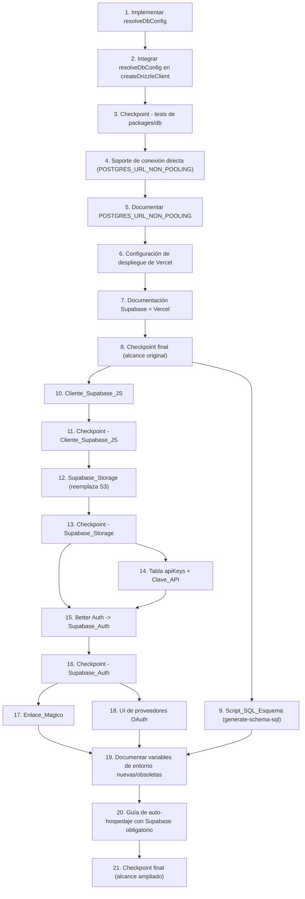

# Implementation Plan: Plan de Implementación: migrate-supabase-vercel

## Overview

El plan implementa primero la lógica pura de resolución de configuración de base de datos (`resolveDbConfig` y resolución de URL de migración) con sus tests, luego la integra en el cliente de Drizzle existente, actualiza la configuración de migraciones (`drizzle.config.ts`), documenta las nuevas variables de entorno en todos los lugares requeridos por `AGENTS.md`, y finalmente añade la configuración de despliegue de Vercel para `apps/web` sin romper las rutas de auto-hospedaje con Docker existentes (tareas 1-8, alcance original de Requisitos 1-5).

A partir de la tarea 9, el plan se amplía para cubrir los Requisitos 6-10: generación del `Script_SQL_Esquema` (independiente del resto), introducción del `Cliente_Supabase_JS` (prerequisito de Storage, Auth, Clave_API y Enlace_Magico), sustitución de S3 por Supabase_Storage, reconstrucción de Clave_API, sustitución completa de Better Auth por Supabase_Auth, reconstrucción de Enlace_Magico, actualización de la UI de proveedores OAuth, documentación de variables de entorno nuevas/obsoletas, y actualización de la guía de auto-hospedaje conforme a la decisión registrada en el Requisito 10 (Supabase es obligatorio también para auto-hospedaje).

## Task Dependency Graph



```json
{
  "waves": [
    { "wave": 1, "tasks": [1] },
    { "wave": 2, "tasks": [2] },
    { "wave": 3, "tasks": [3] },
    { "wave": 4, "tasks": [4] },
    { "wave": 5, "tasks": [5] },
    { "wave": 6, "tasks": [6] },
    { "wave": 7, "tasks": [7] },
    { "wave": 8, "tasks": [8] },
    { "wave": 9, "tasks": [9, 10] },
    { "wave": 10, "tasks": [11] },
    { "wave": 11, "tasks": [12] },
    { "wave": 12, "tasks": [13] },
    { "wave": 13, "tasks": [14] },
    { "wave": 14, "tasks": [15] },
    { "wave": 15, "tasks": [16] },
    { "wave": 16, "tasks": [17, 18] },
    { "wave": 17, "tasks": [19] },
    { "wave": 18, "tasks": [20] },
    { "wave": 19, "tasks": [21] }
  ]
}
```

Notas sobre el grafo: la tarea 9 (Script_SQL_Esquema) es independiente de las tareas 10-18 y puede ejecutarse en paralelo con ellas (solo depende de que exista el checkpoint 8); se agrupa en la misma ola que la tarea 10 por conveniencia, pero no depende de ella. El Cliente_Supabase_JS (tarea 10) es prerequisito de Storage (12), Clave_API (14, vía Redis + DB, no depende directamente del cliente pero sí del checkpoint 11 por orden de trabajo), Supabase_Auth (15) y Enlace_Magico (17), porque todos ellos crean clientes de Supabase para interactuar con Auth/Storage.

## Tasks

- [x] 1. Implementar `resolveDbConfig` en `packages/db/src/client.ts`
  - Crear la interfaz `ResolvedDbConfig` y la función pura `resolveDbConfig(env)` descritas en el diseño, exportadas desde `packages/db/src/client.ts`
  - Implementar las reglas: retorno `null` sin `POSTGRES_URL` fuera de producción, error al lanzar sin `POSTGRES_URL` en producción, `ssl: false` para hosts locales/docker (`localhost`, `127.0.0.1`, `postgres`) o cuando la URL ya contiene `sslmode`, y `ssl: { rejectUnauthorized: false }` para cualquier otro host
  - _Requirements: 1.1, 1.2, 1.4, 7.2_

  - [x]* 1.1 Escribir test de propiedad para `resolveDbConfig`
    - **Property 1: Resolución de configuración de base de datos es coherente con el host y el entorno**
    - **Validates: Requirements 1.1, 1.2, 1.4, 7.2**
    - Usar `fast-check` (añadir como devDependency de `packages/db` si no existe), generando URLs con hosts locales conocidos y hosts remotos arbitrarios (con y sin `sslmode`), y valores de `NODE_ENV`, con mínimo 100 iteraciones
    - Tag: **Feature: migrate-supabase-vercel, Property 1**

  - [x]* 1.2 Escribir tests unitarios para casos concretos de `resolveDbConfig`
    - Caso: `POSTGRES_URL` ausente + `NODE_ENV=development` → `null`
    - Caso: `POSTGRES_URL` ausente + `NODE_ENV=production` → lanza error descriptivo
    - Caso: host `postgres` (servicio de `docker-compose.yml`) → `ssl: false`
    - Caso: host `db.<project>.supabase.co` → `ssl: { rejectUnauthorized: false }`
    - _Requirements: 1.1, 1.2, 1.4_

- [x] 2. Integrar `resolveDbConfig` en `createDrizzleClient` y añadir logging de errores de conexión
  - Modificar `createDrizzleClient` para usar `resolveDbConfig(process.env)` en lugar de leer `process.env.POSTGRES_URL` directamente
  - Pasar el `connectionString` y `ssl` resueltos al `Pool` de `pg`
  - Registrar (mediante `@kan/logger`, `log.error`) un mensaje descriptivo si el primer intento de conexión del `Pool` falla, antes de re-lanzar el error
  - _Requirements: 1.1, 1.2, 1.3, 1.4, 7.2_

  - [x]* 2.1 Escribir test unitario para el logging de fallo de conexión
    - Mockear `Pool` para que la conexión inicial rechace con un error
    - Verificar que `@kan/logger` registra un error con el mensaje original antes de que el error se propague
    - _Requirements: 1.3_

- [x] 3. Checkpoint - Asegurar que todos los tests de `packages/db` pasan
  - Ensure all tests pass, ask the user if questions arise.

- [x] 4. Añadir soporte de conexión directa para migraciones (`POSTGRES_URL_NON_POOLING`)
  - Implementar la función de resolución de URL de migración (prioriza `POSTGRES_URL_NON_POOLING`, cae a `POSTGRES_URL`) en `packages/db/drizzle.config.ts`
  - Actualizar `drizzle.config.ts` para usar dicha función al construir `dbCredentials.url`
  - _Requirements: 2.2, 2.3, 3.1, 3.2_

  - [x]* 4.1 Escribir test de propiedad para la resolución de la URL de migración
    - **Property 2: La URL de migración prioriza la conexión directa sobre la pooled**
    - **Validates: Requirements 2.2, 2.3**
    - Generar combinaciones aleatorias de presencia/ausencia y valor de `POSTGRES_URL_NON_POOLING` y `POSTGRES_URL`, mínimo 100 iteraciones
    - Tag: **Feature: migrate-supabase-vercel, Property 2**

  - [x]* 4.2 Escribir test unitario para el caso de una sola variable (auto-hospedaje)
    - Caso: solo `POSTGRES_URL` definida (sin `POSTGRES_URL_NON_POOLING`) → se usa `POSTGRES_URL` para migraciones
    - _Requirements: 2.3, 7.1_

- [x] 5. Documentar la nueva variable de entorno `POSTGRES_URL_NON_POOLING`
  - Añadir `POSTGRES_URL_NON_POOLING` a `.env.example` con un comentario explicando su propósito (conexión directa para migraciones, requerida al usar Supabase/pooling)
  - Añadir `POSTGRES_URL_NON_POOLING` a `globalEnv` en `turbo.json`
  - Añadir una fila para `POSTGRES_URL_NON_POOLING` en la tabla de variables de entorno de `README.md`
  - _Requirements: 5.3_

- [x] 6. Añadir configuración de despliegue de Vercel para `apps/web`
  - Crear `apps/web/vercel.json` (o el archivo de configuración equivalente) especificando el comando de instalación (`pnpm install --frozen-lockfile` desde la raíz del monorepo) y el comando de build (`turbo run build --filter=@kan/web`)
  - Verificar que `NEXT_PUBLIC_USE_STANDALONE_OUTPUT` no se fuerza a `"true"` en el flujo de Vercel (a diferencia del `Dockerfile`), dejando que `next.config.js` use el valor de entorno tal cual
  - _Requirements: 4.1, 4.2, 4.3_

  - [x]* 6.1 Escribir test de integración para verificar que `docker-compose.yml` y `cloud/docker-compose.yml` siguen siendo válidos
    - Ejecutar `docker compose config` (o equivalente) contra ambos archivos para confirmar que no se rompieron por los cambios de variables de entorno
    - _Requirements: 7.1_

- [x] 7. Actualizar documentación del proyecto para el flujo Supabase + Vercel
  - Añadir una guía (en `apps/docs/guides/self-hosting/` o sección nueva equivalente) que documente: cómo obtener la conexión directa y la conexión pooled desde el dashboard de Supabase, cómo configurar `POSTGRES_URL` y `POSTGRES_URL_NON_POOLING`, cómo configurar el Root Directory `apps/web` en Vercel, y cómo ejecutar `pnpm db:migrate` contra Supabase antes del primer despliegue
  - _Requirements: 3.4_

- [x] 8. Checkpoint final - Asegurar que todos los tests pasan y el proyecto compila
  - Ejecutar `pnpm lint`, `pnpm typecheck` y la suite de tests de `packages/db`
  - Ensure all tests pass, ask the user if questions arise.

- [x] 9. Implementar el Script_SQL_Esquema (`packages/db/scripts/generate-schema-sql.ts`)
  - Crear la función pura `concatenateMigrations(files: { filename: string; contents: string }[]): string` que ordena los archivos por el prefijo de timestamp de su nombre (`<timestamp>_<Nombre>.sql`) y concatena su contenido íntegro en ese orden, separando cada migración con un comentario `-- Migration: <nombre de archivo>`
  - Implementar el script que lee todos los archivos de `packages/db/migrations/*.sql` (excluyendo el directorio `meta/`), invoca `concatenateMigrations`, y escribe el resultado en `packages/db/supabase/schema.sql`; hacer que el script falle explícitamente con un mensaje descriptivo si encuentra un nombre de archivo que no sigue el formato `<timestamp>_<Nombre>.sql` esperado
  - Añadir el script `db:generate-schema-sql` a `packages/db/package.json` y ejecutarlo para generar `packages/db/supabase/schema.sql` a partir de las migraciones actuales
  - Documentar en `AGENTS.md` (sección "Database Changes") que `pnpm db:generate-schema-sql` debe ejecutarse tras generar una nueva migración con `drizzle-kit generate`
  - _Requirements: 6.1, 6.4, 6.5_

  - [x]* 9.1 Escribir test de propiedad para `concatenateMigrations`
    - **Property 3: La concatenación de migraciones preserva orden cronológico y contenido íntegro**
    - **Validates: Requirements 6.5**
    - Generar listas de archivos `(timestamp, contenido)` en orden de entrada aleatorio con `fast-check`, mínimo 100 iteraciones
    - Tag: **Feature: migrate-supabase-vercel, Property 3**

  - [x]* 9.2 Escribir tests unitarios para `concatenateMigrations`
    - Caso: lista vacía → salida vacía
    - Caso: un único archivo → salida igual a su contenido íntegro
    - _Requirements: 6.5_

  - [ ]* 9.3 Escribir test de integración ejecutando `schema.sql` contra Postgres efímero
    - Ejecutar `packages/db/supabase/schema.sql` contra una instancia nueva y vacía de Postgres (por ejemplo vía Testcontainers) y verificar código de salida 0 y presencia de todas las tablas, tipos enumerados, claves foráneas e índices esperados
    - Ejecutar una muestra representativa de funciones de `packages/db/src/repository` contra el esquema generado por `schema.sql` y contra el esquema generado por `pnpm db:migrate`, comparando resultados
    - _Requirements: 6.2, 6.3_

- [x] 10. Implementar el Cliente_Supabase_JS (`packages/shared/src/utils/supabase.ts`)
  - Añadir `@supabase/supabase-js` como dependencia de `packages/shared` en `packages/shared/package.json`
  - Implementar `resolveSupabaseServerConfig(env)` y `resolveSupabaseBrowserConfig(env)` como funciones puras que retornan `null` y registran (`@kan/logger`) un error descriptivo indicando qué variable falta cuando falta alguna variable requerida para su contexto (`NEXT_PUBLIC_SUPABASE_URL` + `SUPABASE_SERVICE_ROLE_KEY` para servidor; `NEXT_PUBLIC_SUPABASE_URL` + `NEXT_PUBLIC_SUPABASE_ANON_KEY` para navegador)
  - Implementar `createSupabaseServerClient()` y `createSupabaseBrowserClient()`, que lanzan un error en lugar de retornar un cliente parcialmente inicializado cuando la función de resolución correspondiente retorna `null`
  - Asegurar que `resolveSupabaseServerConfig`/`createSupabaseServerClient` no se reexportan desde ningún punto de entrada de `packages/shared` consumido por código de navegador (revisar `packages/shared/package.json`/`src/index.ts`), de forma análoga a cómo `S3_SECRET_ACCESS_KEY` se mantiene hoy fuera del bundle del navegador
  - _Requirements: 7.1, 7.2, 7.3, 7.4, 7.5, 7.6_

  - [x]* 10.1 Escribir test de propiedad para la resolución de configuración de Supabase
    - **Property 4: La resolución de configuración de Supabase respeta el aislamiento servidor/navegador**
    - **Validates: Requirements 7.2, 7.3, 7.4, 7.5, 7.6**
    - Generar combinaciones aleatorias de presencia/ausencia de las 3 variables de entorno con `fast-check`, verificando que `SUPABASE_SERVICE_ROLE_KEY` nunca aparece en la config de navegador, mínimo 100 iteraciones
    - Tag: **Feature: migrate-supabase-vercel, Property 4**

  - [x]* 10.2 Escribir tests unitarios para `resolveSupabaseServerConfig`/`resolveSupabaseBrowserConfig`
    - Caso: todas las variables presentes para cada función
    - Caso: cada variable individual ausente, verificando el mensaje de `@kan/logger`
    - _Requirements: 7.5, 7.6_

- [x] 11. Checkpoint - Asegurar que todos los tests de `packages/shared` (Cliente_Supabase_JS) pasan
  - Ensure all tests pass, ask the user if questions arise.

- [x] 12. Sustituir S3 por Supabase_Storage (`packages/shared/src/utils/storage.ts`)
  - Crear `packages/shared/src/utils/storage.ts` reemplazando `packages/shared/src/utils/s3.ts`, preservando las firmas de función existentes: `generateUploadUrl(bucket, key, contentType, expiresIn?)`, `generateDownloadUrl(bucket, key, expiresIn?)`, `deleteObject(bucket, key)`, `generateAvatarUrl(imageKey, expiresIn?)`, `generateAttachmentUrl(attachmentKey, expiresIn?)`, usando `createSupabaseServerClient().storage.from(bucket)` (`createSignedUploadUrl`/`createSignedUrl`/`remove`) en lugar de `@aws-sdk/client-s3`
  - Implementar la función pura `clampExpiresIn(requested, operation)` (máximo 60s para `"upload"`, 3600s para `"download"`, mínimo 1s) y usarla dentro de `generateUploadUrl`/`generateDownloadUrl`
  - Implementar la función pura `validateUploadRequest(input, limits)` que valida tamaño máximo y tipos de contenido permitidos, e invocarla en `packages/api/src/routers/attachment.ts` antes de llamar a `generateUploadUrl`
  - Actualizar `packages/api/src/routers/attachment.ts` para usar `storage.ts` en lugar de `s3.ts`, cambiando el `console.error`/manejo actual de fallo de `deleteObject` para usar `@kan/logger` (`log.error`) sin bloquear el soft-delete existente
  - Actualizar `packages/auth/src/hooks.ts` (lógica de subida de avatar) para usar `storage.ts` en lugar de `createS3Client`/`PutObjectCommand`
  - Actualizar `packages/api/src/routers/health.ts`: reemplazar `checkS3Connection` por `checkSupabaseStorageConnection`, verificando configuración presente y luego `supabase.storage.getBucket(...)` para los buckets de avatares y adjuntos, preservando el mapeo a los estados `ok`/`error`/`not_configured`
  - Eliminar `packages/shared/src/utils/s3.ts` y la dependencia `@aws-sdk/client-s3` si ningún otro módulo la usa
  - _Requirements: 9.1, 9.2, 9.3, 9.4, 9.5, 9.6, 9.7, 9.8, 9.9_

  - [ ]* 12.1 Escribir test de propiedad para `clampExpiresIn`
    - **Property 11: La expiración de URLs firmadas de Supabase_Storage siempre respeta el máximo por tipo de operación**
    - **Validates: Requirements 9.3, 9.4**
    - Generar valores de `expiresIn` arbitrarios (negativos, cero, límites exactos, excesos) y ambos tipos de operación con `fast-check`, mínimo 100 iteraciones
    - Tag: **Feature: migrate-supabase-vercel, Property 11**

  - [ ]* 12.2 Escribir test de propiedad para `generateAvatarUrl`
    - **Property 12: La URL de avatar externa se retorna sin resolución contra Supabase_Storage**
    - **Validates: Requirements 9.6**
    - Generar `imageKey` arbitrario (URLs `http`/`https`, claves relativas no vacías, `null`, `undefined`, cadena vacía) con `fast-check`, usando un mock del cliente de Storage que registra si fue invocado, mínimo 100 iteraciones
    - Tag: **Feature: migrate-supabase-vercel, Property 12**

  - [ ]* 12.3 Escribir test de propiedad para el fallo no bloqueante de `deleteObject`
    - **Property 13: El fallo de eliminación en Supabase_Storage nunca bloquea el soft-delete en packages/db**
    - **Validates: Requirements 9.9**
    - Generar resultados aleatorios (éxito/fallo) de un mock de eliminación de Storage con `fast-check`, verificando que el soft-delete siempre se invoca y que el logger de error se invoca únicamente en el caso de fallo, mínimo 100 iteraciones
    - Tag: **Feature: migrate-supabase-vercel, Property 13**

  - [ ]* 12.4 Escribir test de propiedad para `validateUploadRequest`
    - **Property 14: La validación de solicitudes de carga rechaza tamaños y tipos de contenido no permitidos**
    - **Validates: Requirements 9.8**
    - Generar tamaños arbitrarios (negativos, cero, límite exacto, excesos) y tipos de contenido arbitrarios (dentro/fuera de la lista permitida) con `fast-check`, mínimo 100 iteraciones
    - Tag: **Feature: migrate-supabase-vercel, Property 14**

  - [ ]* 12.5 Escribir tests unitarios para `storage.ts` y `checkSupabaseStorageConnection`
    - Caso: `generateAvatarUrl` retorna `null` cuando `imageKey` es `null`/`undefined`
    - Caso: `checkSupabaseStorageConnection` retorna `not_configured` cuando faltan las variables de Supabase (mock)
    - _Requirements: 9.6, 9.7_

- [x] 13. Checkpoint - Asegurar que todos los tests de Supabase_Storage pasan
  - Ensure all tests pass, ask the user if questions arise.

- [x] 14. Reconstruir Clave_API (tabla `apiKeys` + validación + rate limiting)
  - Crear el esquema Drizzle `packages/db/src/schema/apiKeys.ts` con la tabla `apiKeys` descrita en el diseño (`id`, `publicId`, `name`, `keyHash`, `keyPrefix`, `userId`, `rateLimitMax`, `rateLimitWindowMs`, `revokedAt`, `expiresAt`, `lastUsedAt`, `createdAt`), y generar la migración correspondiente con `cd packages/db && pnpm drizzle-kit generate --name "AddApiKeysTable"`
  - Implementar las funciones puras `extractApiKeyFromHeaders(headers)` (prioriza `Authorization: Bearer` sobre `x-api-key`), `hashApiKey(plaintext)` (SHA-256 hex), y `findMatchingApiKey(hash, storedKeys, now)` (coincidencia por hash exacto, no revocada, no expirada)
  - Implementar la generación de Clave_API (secreto aleatorio `kan_` + 32 bytes en base62, mostrado una única vez, persistiendo solo `keyHash`)
  - Implementar el middleware de tRPC que usa `extractApiKeyFromHeaders` + `hashApiKey` + una consulta por `keyHash` a `packages/db` para autenticar la solicitud, rechazando con `UNAUTHORIZED` cuando no hay coincidencia
  - Implementar el rate limiting de ventana deslizante (100 solicitudes/60s por `publicId` de Clave_API) reutilizando `packages/db/src/redis.ts` (`getRedisClient`), con fallback a un contador en memoria por proceso cuando `REDIS_URL` no está configurada; rechazar con `TRPCError({ code: "TOO_MANY_REQUESTS" })` al exceder el límite
  - Ejecutar `pnpm db:generate-schema-sql` (tarea 9) para incorporar la tabla `apiKeys` al `Script_SQL_Esquema`
  - _Requirements: 8.15, 8.16, 8.17_

  - [ ]* 14.1 Escribir test de propiedad para `findMatchingApiKey`
    - **Property 8: La validación de Clave_API acepta únicamente coincidencias de hash activas y vigentes**
    - **Validates: Requirements 8.15, 8.17**
    - Generar conjuntos aleatorios de claves almacenadas (hash, revocación, expiración arbitrarios) y claves en texto plano arbitrarias (incluyendo variaciones de un carácter de claves válidas) con `fast-check`, mínimo 100 iteraciones
    - Tag: **Feature: migrate-supabase-vercel, Property 8**

  - [ ]* 14.2 Escribir test de propiedad para el rate limiting de ventana deslizante
    - **Property 9: El límite de tasa de Clave_API nunca permite más de 100 solicitudes por ventana de 60 segundos**
    - **Validates: Requirements 8.16**
    - Generar secuencias aleatorias de marcas de tiempo de solicitud con `fast-check`, verificando que nunca se aceptan más de 100 solicitudes en ningún intervalo de 60 segundos consecutivos, mínimo 100 iteraciones
    - Tag: **Feature: migrate-supabase-vercel, Property 9**

  - [ ]* 14.3 Escribir tests unitarios para `extractApiKeyFromHeaders`
    - Caso: prioriza `Authorization: Bearer` sobre `x-api-key` cuando ambos están presentes
    - Caso: retorna `null` cuando ninguno está presente
    - _Requirements: 8.17_

- [x] 15. Sustituir Better Auth por Supabase_Auth (`packages/auth`)
  - Reescribir `packages/auth/src/auth.ts`: eliminar la llamada a `betterAuth(...)`; exportar `signUpWithPassword({ email, password })`, `signInWithPassword({ email, password })`, `resetPasswordForEmail(email)`, `signOut()` delegando a `createSupabaseServerClient().auth.*`; implementar `getSession(req, res)` usando `@supabase/ssr` para leer la sesión desde las cookies en el patrón de Pages Router
  - Actualizar `packages/auth/src/providers.ts`: eliminar `socialProvidersPlugin`/`configuredProviders` basado en `better-auth/social-providers`; añadir la función pura `getSupportedOAuthProviders(configuredEnvProviders: string[]): string[]` que excluye `kick`, `dropbox`, `vk`, `reddit`, `roblox`
  - Actualizar `packages/auth/src/hooks.ts`: extraer la función pura `isSignUpAllowed({ email, disableSignUp, hasPendingInvitation, allowedDomains })`, invocarla antes de `signUpWithPassword` en el procedimiento de registro, rechazando sin invocar a Supabase_Auth cuando retorna `false`; sustituir la subida de avatar de `user.create.after` para usar `storage.ts` (tarea 12) en lugar de `s3.ts`
  - Eliminar `packages/auth/src/plugins.ts` por completo (bloques `stripe`, `apiKey`, `magicLink`, `genericOAuth`)
  - Implementar la eliminación de usuario como operación de dos fases: ejecutar los `DELETE`/anonimizaciones de `packages/db` dentro de `db.transaction(...)`, invocando `supabase.auth.admin.deleteUser(userId)` como último paso dentro del callback de la transacción, relanzando el error (provocando `ROLLBACK`) si dicha llamada falla
  - Actualizar todos los puntos de integración que hoy usan `auth.api.getSession`/`auth.api.*` (contexto de tRPC, `getServerSideProps` de `apps/web`) para usar las nuevas funciones de `packages/auth`
  - _Requirements: 8.1, 8.2, 8.3, 8.4, 8.5, 8.6, 8.7, 8.8, 8.10, 8.11, 8.12, 8.13, 8.14_

  - [ ]* 15.1 Escribir test de propiedad para la eliminación de usuario en dos fases
    - **Property 5: La eliminación de usuario nunca deja un estado parcial entre Supabase_Auth y packages/db**
    - **Validates: Requirements 8.3, 8.12**
    - Usando mocks del cliente de Supabase Auth y de la transacción de `packages/db` que fallan/tienen éxito según parámetros generados por `fast-check`, verificar que el estado final es siempre "ambos eliminados" o "ninguno eliminado", mínimo 100 iteraciones
    - Tag: **Feature: migrate-supabase-vercel, Property 5**

  - [ ]* 15.2 Escribir test de propiedad para `getSupportedOAuthProviders`
    - **Property 6: El filtrado de proveedores OAuth excluye siempre a los proveedores sin soporte nativo**
    - **Validates: Requirements 8.5, 8.6**
    - Generar subconjuntos aleatorios de identificadores de proveedor con `fast-check`, verificando que el resultado nunca incluye `kick`, `dropbox`, `vk`, `reddit`, `roblox`, mínimo 100 iteraciones
    - Tag: **Feature: migrate-supabase-vercel, Property 6**

  - [ ]* 15.3 Escribir test de propiedad para `isSignUpAllowed`
    - **Property 7: La autorización de registro es coherente con las reglas de invitación y dominio permitido**
    - **Validates: Requirements 8.7, 8.13**
    - Generar combinaciones aleatorias de correo, `disableSignUp`, presencia de invitación, y listas de dominios permitidos (incluyendo vacía) con `fast-check`, mínimo 100 iteraciones
    - Tag: **Feature: migrate-supabase-vercel, Property 7**

  - [ ]* 15.4 Escribir tests unitarios para `packages/auth`
    - Caso: `isSignUpAllowed` con `disableSignUp: false` y sin restricciones de dominio retorna `true` para cualquier correo
    - Caso: inicio de sesión con credenciales inválidas rechaza sin crear sesión y retorna mensaje de error genérico
    - Caso: fallo de inicialización de Supabase_Auth registra `@kan/logger` con el mensaje original
    - _Requirements: 8.10, 8.11_

- [x] 16. Checkpoint - Asegurar que todos los tests de Supabase_Auth pasan
  - Ensure all tests pass, ask the user if questions arise.

- [x] 17. Reconstruir Enlace_Magico (login sin contraseña e invitaciones)
  - Implementar el envío de Enlace_Magico para login sin contraseña usando `createSupabaseServerClient().auth.signInWithOtp({ email, options: { emailRedirectTo: \`${baseUrl}/auth/callback\` } })`, invocado desde el mismo punto de entrada de tRPC/handler que hoy expone el login sin contraseña
  - Actualizar `packages/api/src/routers/member.ts` para que las invitaciones a espacio de trabajo usen `signInWithOtp` con `emailRedirectTo: \`${baseUrl}/auth/callback?type=invite&memberPublicId=${invite.publicId}\`` en lugar de construir un `callbackURL` de Better Auth
  - Crear la ruta de callback nueva (`apps/web/src/pages/auth/callback.tsx` o `pages/api/auth/callback.ts`) que lee `type`/`memberPublicId` de los query params tras el intercambio de sesión de Supabase_Auth
  - Implementar las funciones puras `parseInviteCallbackParams(query)` y `completeInvite(memberPublicId, userId, memberLookup, acceptInvite)`, reutilizando la lógica hoy presente en `createMiddlewareHooks` de `packages/auth/src/hooks.ts` (`memberRepo.getByPublicId` + `memberRepo.acceptInvite`)
  - Conectar la ruta de callback para invocar `parseInviteCallbackParams`/`completeInvite` y mostrar un mensaje de error cuando `completeInvite` retorne `success: false`
  - _Requirements: 8.18, 8.19, 8.20_

  - [ ]* 17.1 Escribir test de propiedad para `completeInvite`
    - **Property 10: La finalización de invitación por Enlace_Magico depende únicamente del estado del miembro referenciado**
    - **Validates: Requirements 8.19, 8.20**
    - Generar valores aleatorios de `memberPublicId` y estados simulados del miembro (inexistente, `"invited"`, otro estado) con `fast-check`, mínimo 100 iteraciones
    - Tag: **Feature: migrate-supabase-vercel, Property 10**

  - [ ]* 17.2 Escribir test de integración para el flujo de invitación completo
    - Con un `memberLookup` mockeado que retorna un miembro con estado `"invited"`, verificar que `completeInvite` invoca `acceptInvite` exactamente una vez
    - Verificar que `signInWithOtp` se invoca con el `emailRedirectTo` correcto tanto para login sin contraseña como para invitaciones (mock del cliente de Supabase Auth)
    - _Requirements: 8.18, 8.19_

- [x] 18. Actualizar la UI de proveedores OAuth en `apps/web`
  - Eliminar los botones/entradas de inicio de sesión social para los proveedores excluidos (Kick, Dropbox, VK, Reddit, Roblox) en las vistas de login/signup de `apps/web`
  - Conectar la lista de proveedores mostrados en la UI con `getSupportedOAuthProviders` (tarea 15) en lugar de una lista estática que incluya los proveedores excluidos
  - Documentar en la guía de despliegue (o comentario en `providers.ts`) que la configuración de client id/secret por proveedor OAuth soportado se realiza en el dashboard de Supabase, no mediante las Variables_De_Entorno actuales de Better Auth
  - _Requirements: 8.6_

- [x] 19. Documentar variables de entorno nuevas y obsoletas
  - Añadir `NEXT_PUBLIC_SUPABASE_URL`, `NEXT_PUBLIC_SUPABASE_ANON_KEY` y `SUPABASE_SERVICE_ROLE_KEY` a `.env.example` (con comentario explicativo), `turbo.json` (`globalEnv`), `docker-compose.yml` (servicio `web`), `cloud/docker-compose.yml` (servicio `web`), y una fila por variable en la tabla de `README.md`, siguiendo el procedimiento de "Adding a New Environment Variable" de `AGENTS.md`
  - Marcar como obsoletas en `.env.example` (comentario indicando reemplazo, sin eliminar la fila hasta que se resuelva la pregunta abierta de migración de datos) las Variables_De_Entorno específicas de S3 (`S3_*`) que ya no se leen tras la tarea 12; documentar el cambio de uso de `BETTER_AUTH_SECRET` (ya no usado por `packages/auth/src/auth.ts` tras la tarea 15) en el mismo comentario
  - _Requirements: 5.3, 9.1, 9.2_

- [x] 20. Actualizar la guía de auto-hospedaje para reflejar la decisión del Requisito 10
  - Actualizar `docker-compose.yml` y `cloud/docker-compose.yml` para declarar `NEXT_PUBLIC_SUPABASE_URL`, `NEXT_PUBLIC_SUPABASE_ANON_KEY` y `SUPABASE_SERVICE_ROLE_KEY` como variables requeridas del servicio `web`, del mismo modo que hoy declaran `BETTER_AUTH_SECRET`
  - Crear una nueva página de guía de auto-hospedaje (equivalente a `apps/docs/guides/self-hosting/s3.mdx` pero para Supabase, por ejemplo `apps/docs/guides/self-hosting/supabase.mdx`) documentando la decisión de diseño registrada en el Requisito 10 (Supabase es obligatorio también para auto-hospedaje, incluyendo la opción de auto-hospedar `supabase/docker`) y los pasos para obtener las credenciales necesarias
  - Actualizar `apps/docs/guides/self-hosting/introduction.mdx` para referenciar la nueva página y el requisito previo de una cuenta/instancia de Supabase
  - _Requirements: 10.1, 10.2, 10.4_

- [-] 21. Checkpoint final - Asegurar que todos los tests pasan y el proyecto compila (alcance ampliado)
  - Ejecutar `pnpm lint`, `pnpm typecheck` y la suite de tests completa del monorepo (`packages/db`, `packages/shared`, `packages/auth`, `packages/api`, `apps/web`)
  - Ensure all tests pass, ask the user if questions arise.

## Notes

- Las tareas marcadas con `*` son opcionales (principalmente tests) y pueden omitirse para un MVP más rápido, aunque se recomienda implementarlas dado que cubren la lógica de conexión, autenticación, almacenamiento y autorización crítica para producción.
- Este plan no incluye la creación real del proyecto de Supabase, la configuración manual de variables de entorno/proveedores OAuth en los dashboards de Vercel/Supabase, ni el despliegue real — esas son acciones operativas fuera del alcance de un agente de código (ver Requisitos 4.4, 5.1, 5.2, 6.1, 6.2, 6.3, que son de configuración/alcance y no requieren cambios de código).
- Los checkpoints (tareas 3, 8, 11, 13, 16 y 21) son puntos para validar antes de continuar.
- **Eliminación de facturación Stripe**: el Requisito 8.14 excluye explícitamente de esta migración la reconstrucción de la facturación de suscripciones de Stripe hoy provista por el plugin `stripe` de Better Auth (`@better-auth/stripe`, incluyendo períodos de prueba, planes de equipo/pro y webhooks de suscripción). Al eliminar `packages/auth/src/plugins.ts` (tarea 15), dicho bloque se elimina sin reemplazo; no se debe reintroducir esta funcionalidad como parte de las tareas de este plan.
- **Exclusión de proveedores OAuth**: Kick, Dropbox, VK, Reddit y Roblox quedan excluidos de esta migración por no contar con soporte nativo en Supabase_Auth (Requisito 8.6), y el plugin `genericOAuth`/OIDC genérico se elimina sin reemplazo (tarea 15), por lo que no existe una vía de reemplazo para dichos proveedores dentro de este plan.
- **Datos existentes**: la migración de usuarios/sesiones existentes de Better Auth hacia Supabase_Auth (Requisito 8.9) y la migración de archivos existentes de S3 hacia Supabase_Storage (Requisito 9.10) quedan como preguntas abiertas sin resolver en el diseño; ninguna tarea de este plan asume o implementa dicha migración de datos.
- **apiKeys y Script_SQL_Esquema**: recordar ejecutar `pnpm db:generate-schema-sql` (tarea 9) después de la migración de la tarea 14 para mantener `packages/db/supabase/schema.sql` sincronizado con la nueva tabla `apiKeys`.
